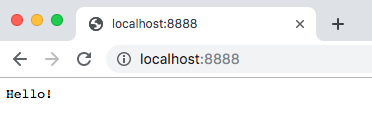

# learn-deno-http-server

## Getting Started

### Install deno

```sh
curl -fL https://deno.land/x/install/install.sh | sh
echo "export PATH="~/.deno/bin:$PATH"" >> ~/your_shell_rc
```

### Run

```sh
deno run -A server.ts
```

Go to http://localhost:8888


